# Dokumentasi Use Case Diagram - Website SSIP IF ITENAS

Dokumen ini berisi use case diagram untuk aplikasi utama **SSIP (Sistem Informasi dan Pengelolaan Laboratorium Informatika Itenas)** serta detail use case diagram untuk masing-masing fitur/modul yang ada. Seluruh diagram dibuat menggunakan kode **Mermaid** dengan orientasi **vertikal (Top-Down)** agar lebih mudah dibaca dan digabungkan ke laporan.

---

## 👥 Aktor Sistem
Sistem SSIP memiliki 4 aktor utama dengan peran sebagai berikut:
1. **Pengunjung Umum / Mahasiswa (Public Guest)**: Pengguna tanpa login yang dapat mengakses informasi publik seperti profil lab, berita, jadwal praktikum publik, penelitian, publikasi, modul praktikum, dan formulir rekrutmen/kontak.
2. **Asisten (Asisten Laboratorium)**: Anggota lab terdaftar yang memiliki hak akses untuk login, melihat jadwal mengajar pribadi (*Jadwal Saya*), dan melakukan klaim serta mengunduh *Sertifikat Apresiasi* jika masa tugasnya telah diselesaikan.
3. **Dosen**: Staff pengajar/dosen yang memiliki hak akses login dan melihat jadwal mengajar pribadi.
4. **Admin (Super Admin)**: Pengelola sistem dengan hak akses penuh untuk melakukan operasi CRUD (Create, Read, Update, Delete) pada seluruh data master, mengelola konfigurasi sertifikat, mengubah status tugas asisten, serta mengatur hak akses dinamis (RBAC) untuk Asisten dan Dosen.

---

## 🗺️ 1. Main App Use Case Diagram (Overview)
Diagram ini menggambarkan gambaran umum hubungan seluruh aktor dengan modul-modul utama di dalam sistem SSIP.

```mermaid
graph TD
    %% Actors Definition
    Public((👤 Mahasiswa / Umum))
    Asisten((👤 Asisten Lab))
    Dosen((👤 Dosen))
    Admin((👑 Admin))

    %% System Boundary
    subgraph "Sistem Informasi & Pengelolaan Laboratorium (SSIP)"
        UC_Home([Lihat Profil Lab, Visi Misi & Organisasi])
        UC_News([Lihat Berita & Kegiatan])
        UC_Schedule_Pub([Lihat Jadwal Praktikum])
        UC_Proj_Pub([Lihat Riset & Project Lab])
        UC_Modul_Pub([Lihat & Unduh Modul])
        UC_Recruit_Pub([Lihat Lowongan Rekrutmen])
        UC_Contact([Kirim Pesan Kontak])
        
        UC_Auth([Login, Logout & Kelola Profil])
        
        UC_Sched_Aslab([Lihat Jadwal Saya])
        UC_Claim_Cert([Klaim & Unduh Sertifikat])
        
        UC_M_Users([Kelola Anggota & Periode Asisten])
        UC_M_Sched([Kelola Jadwal Praktikum])
        UC_M_Modul([Kelola Modul Praktikum])
        UC_M_Riset([Kelola Riset & Publikasi])
        UC_M_Proj([Kelola Project Lab & Member])
        UC_M_Cert([Kelola Template & Status Sertifikat])
        UC_M_Recruit([Kelola lowongan Rekrutmen])
        UC_M_RBAC([Kelola Hak Akses RBAC])
        UC_M_General([Kelola Berita, Event & Ruangan])
    end

    %% Relations for Public Guest
    Public --> UC_Home
    Public --> UC_News
    Public --> UC_Schedule_Pub
    Public --> UC_Proj_Pub
    Public --> UC_Modul_Pub
    Public --> UC_Recruit_Pub
    Public --> UC_Contact
    Public --> UC_Auth

    %% Relations for Asisten Lab
    Asisten --> UC_Auth
    Asisten --> UC_Sched_Aslab
    Asisten --> UC_Claim_Cert
    
    %% Relations for Dosen
    Dosen --> UC_Auth
    Dosen --> UC_Sched_Aslab
    
    %% Relations for Admin
    Admin --> UC_Auth
    Admin --> UC_M_Users
    Admin --> UC_M_Sched
    Admin --> UC_M_Modul
    Admin --> UC_M_Riset
    Admin --> UC_M_Proj
    Admin --> UC_M_Cert
    Admin --> UC_M_Recruit
    Admin --> UC_M_RBAC
    Admin --> UC_M_General
```

---

## 🛠️ 2. Detail Use Case Diagram per Fitur

Berikut adalah rincian use case diagram untuk setiap fitur dengan format visual vertikal:

### 2.1. Fitur Autentikasi & Manajemen Profil
Fitur ini menangani proses masuk ke sistem, pengamanan sesi (session security), pembatasan percobaan login (throttling), serta pengelolaan data profil pengguna.

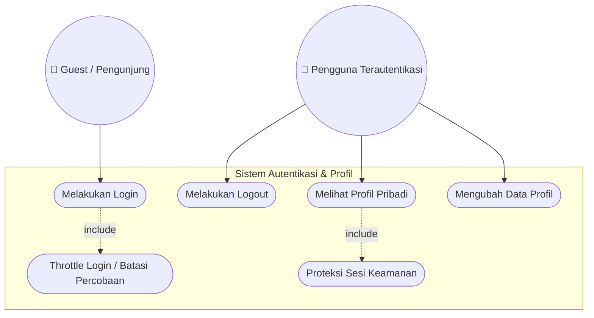
* **Deskripsi**: Guest memasukkan NRP/NIDN dan password. Sistem membatasi percobaan login (throttle) untuk keamanan dari serangan brute-force. Setelah masuk, Pengguna Terautentikasi (Admin/Asisten/Dosen) dapat mengelola profil pribadi, mengubah password, dan melakukan logout dengan sesi yang terproteksi.

---

### 2.2. Fitur Kelola Anggota Laboratorium (Users & Periode)
Modul ini digunakan oleh Admin untuk mengelola akun anggota laboratorium, riwayat jabatan, serta periode aktif asisten.

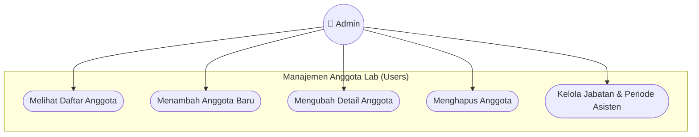
* **Deskripsi**: Admin dapat melakukan manajemen data pengguna laboratorium, menetapkan peran (Role), serta mengatur periode kerja asisten dan jabatan mereka pada periode aktif tertentu.

---

### 2.3. Fitur Kelola Jadwal Praktikum & Jadwal Saya
Fitur ini mencakup penjadwalan sesi praktikum secara keseluruhan dan fitur jadwal pribadi untuk asisten dan dosen.

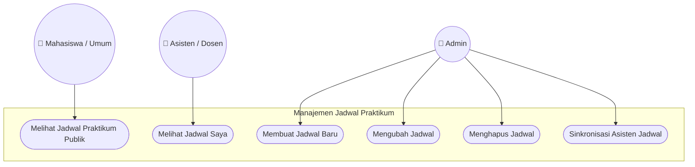
* **Deskripsi**: Mahasiswa dapat melihat jadwal praktikum umum di halaman publik. Asisten atau Dosen yang login dapat melihat agenda mengajar spesifik mereka di menu *Jadwal Saya*. Admin berhak mengelola seluruh jadwal praktikum, menetapkan hari/jam, serta mensinkronisasikan asisten yang bertugas pada jadwal tersebut.

---

### 2.4. Fitur Kelola Modul Praktikum
Modul ini berfungsi untuk menyimpan, mendistribusikan, dan mempratinjau modul praktikum yang digunakan di lingkungan program studi.

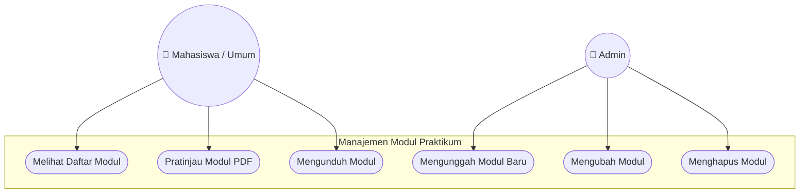
* **Deskripsi**: Mahasiswa secara bebas dapat mencari, melakukan pratinjau (preview), dan mengunduh berkas modul praktikum. Admin memiliki wewenang mengunggah berkas PDF modul baru, mengedit informasi modul, serta menghapusnya dari repositori server.

---

### 2.5. Fitur Kelola Proyek Riset & Penelitian
Menyajikan informasi mengenai penelitian-penelitian aktif yang dilakukan oleh dosen dan asisten di laboratorium.

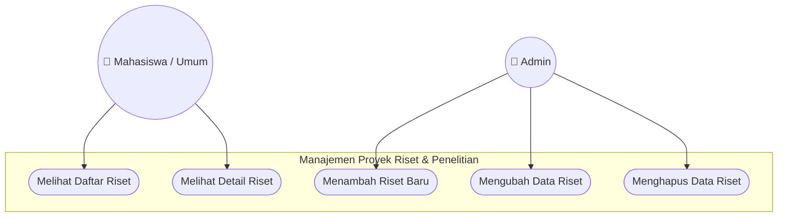
* **Deskripsi**: Publik dapat mengeksplorasi proyek riset serta membaca detail penelitian laboratorium. Admin mengelola (tambah, edit, hapus) katalog riset tersebut agar data selalu diperbarui.

---

### 2.6. Fitur Kelola Publikasi Ilmiah
Modul yang mendokumentasikan karya tulis ilmiah, jurnal, atau prosiding yang diterbitkan oleh civitas akademika laboratorium.

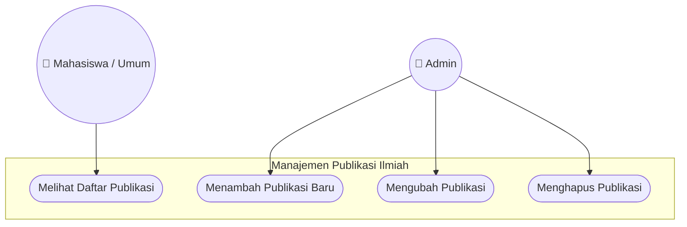
* **Deskripsi**: Pengunjung dapat melihat daftar artikel ilmiah yang telah terbit. Admin bertindak sebagai kurator yang mengelola entri publikasi ilmiah tersebut.

---

### 2.7. Fitur Kelola Project Lab
Digunakan untuk mencatat proyek perangkat lunak atau sistem yang dikembangkan di laboratorium (termasuk daftar pengembang/anggota project).

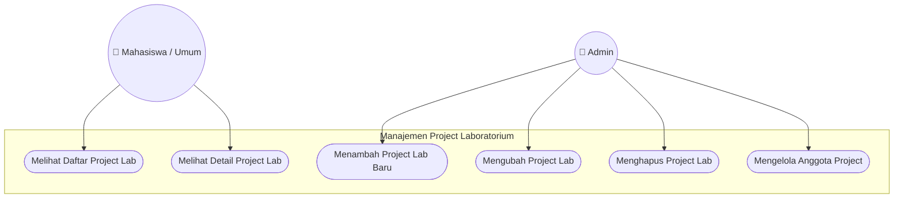
* **Deskripsi**: Pengunjung umum dapat memantau produk/sistem yang dihasilkan laboratorium. Admin mengelola data project dan memasukkan asisten/dosen ke dalam tim pengembang project tersebut (*Manage Members*).

---

### 2.8. Fitur Kelola Galeri & Repositori
Menyimpan dokumentasi foto kegiatan laboratorium serta file repositori publik lainnya.

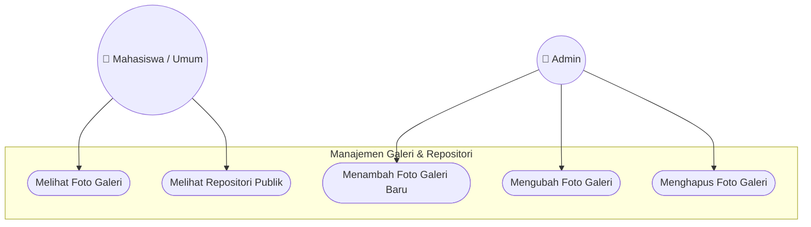
* **Deskripsi**: Publik dapat melihat dokumentasi visual berupa foto kegiatan lab dan file pendukung repositori. Admin mengunggah gambar dokumentasi baru dan menghapus galeri yang sudah usang.

---

### 2.9. Fitur Kelola Rekrutmen Asisten
Fitur pengumuman penerimaan calon asisten baru di laboratorium.

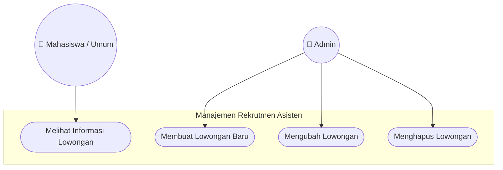
* **Deskripsi**: Mahasiswa dapat memantau pembukaan rekrutmen asisten beserta kualifikasi dan syarat pendaftaran. Admin membuat, memperbarui status (aktif/tutup), dan mengedit persyaratan rekrutmen.

---

### 2.10. Fitur Kelola Sertifikat & Klaim Sertifikat
Sistem untuk menerbitkan sertifikat apresiasi bagi asisten. Sertifikat digenerate secara otomatis menjadi gambar/PDF dengan menempelkan nama asisten, NRP, dan tanda tangan digital Kepala Lab & Ketua Prodi secara dinamis.

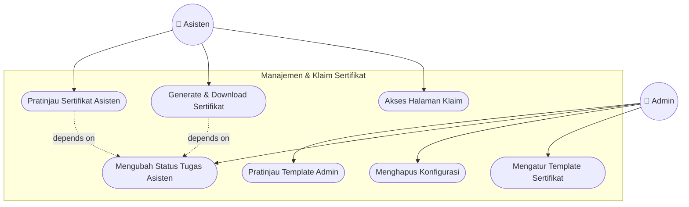
* **Deskripsi**: Asisten dapat mengklaim sertifikat. Namun, proses klaim dan pengunduhan hanya dapat dilakukan jika Admin telah menandai status tugas asisten tersebut sebagai **"selesai"**. Admin juga berhak menyetel gambar background template sertifikat, mengunggah tanda tangan (TTD) Kepala Lab/Ketua Prodi, serta melakukan pratinjau template konfigurasi.

---

### 2.11. Fitur Kelola Berita & Events
Modul publikasi artikel berita internal, pengumuman, serta agenda event/kegiatan mendatang.

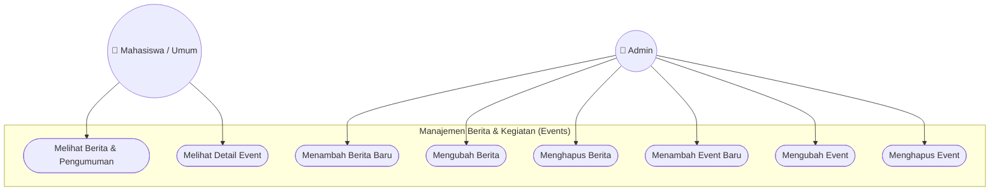
* **Deskripsi**: Publik dapat membaca berita dan event terbaru laboratorium. Admin mengelola seluruh konten berita dan event (seperti Seminar, Workshop, dll.).

---

### 2.12. Fitur Kelola Visi Misi & Ruangan
Pengelolaan konten statis visi-misi laboratorium serta inventaris ruangan praktikum yang tersedia.

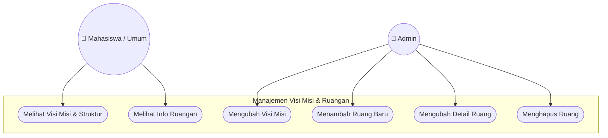
* **Deskripsi**: Pengguna dapat melihat sejarah, visi misi, struktur organisasi lab, serta kapasitas ruangan praktikum. Admin dapat memperbarui informasi teks visi misi dan mengelola data fisik ruangan laboratorium.

---

### 2.13. Fitur Kelola Hak Akses / RBAC (Role-Based Access Control)
Fitur inti keamanan sistem untuk membatasi fungsionalitas menu bagi peran Asisten dan Dosen secara dinamis.

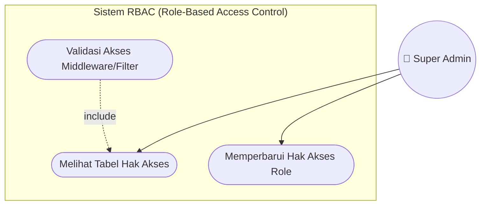
* **Deskripsi**: Super Admin memiliki otorisasi penuh untuk menyalakan/mematikan menu administratif tertentu bagi asisten maupun dosen (misalnya memberi asisten izin untuk mengelola modul praktikum). Sistem secara otomatis memvalidasi hak akses ini di tingkat server menggunakan filter/middleware sebelum memproses request pengguna.

---

> **Tips untuk Penulisan Laporan Kerja Praktek**:
> Anda bisa menyalin kode Mermaid di atas langsung ke aplikasi Markdown editor Anda. Untuk memasukkan diagram ini ke aplikasi pengolah kata seperti Microsoft Word, disarankan untuk merender diagram ini terlebih dahulu di markdown editor (atau [Mermaid Live Editor](https://mermaid.live/)), lalu mengekspornya ke format gambar PNG atau SVG dengan resolusi tinggi.
